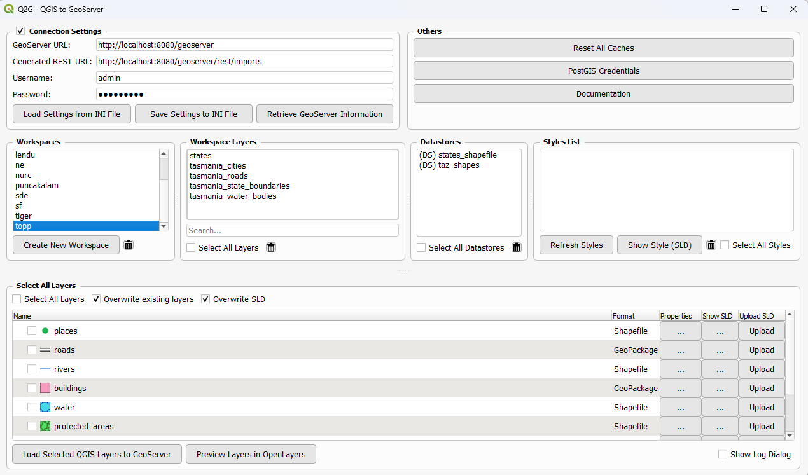
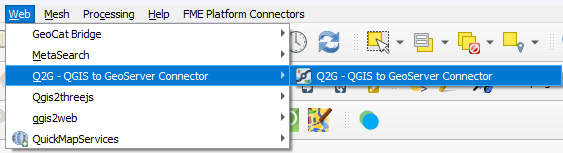

# Q2G - QGIS to GeoServer Connector

The Q2G - QGIS to GeoServer Connector plugin is a powerful tool that bridges QGIS and GeoServer, enabling seamless data publishing and management between these two platforms. This plugin allows QGIS users to upload layers, manage styles, and configure workspaces directly from the QGIS interface. To use this plugin, ensure you have access to a running GeoServer instance with appropriate credentials.

## Overview

Q2G - QGIS to GeoServer Connector simplifies the workflow of publishing geospatial data from QGIS to GeoServer. It handles layer uploads, SLD style management, workspace creation, and provides real-time preview capabilities through an integrated OpenLayers map viewer.

The extension is available from the official repository, [QGIS plugins page](https://plugins.qgis.org/plugins/geoserverconnector/). 

Use the QGIS Plugins menu to install the Q2G - QGIS to GeoServer Connector, [QGIS manual](https://docs.qgis.org/3.34/en/docs/user_manual/plugins/plugins.html).

**Developed with:** QGIS 3.40 or latest

## Key Features

- **Direct Layer Upload**: Upload vector and raster layers from QGIS to GeoServer with a single click
- **Workspace Management**: Create, delete, and manage GeoServer workspaces
- **Style Management**: Convert QGIS symbology to SLD and upload styles to GeoServer
- **Layer Preview**: Real-time preview of published layers using OpenLayers
- **Batch Operations**: Upload multiple layers simultaneously
- **PostGIS Support**: Register and manage PostGIS datastores
- **GeoPackage Support**: Upload and manage GeoPackage layers
- **Cache Management**: Reset caches to ensure fresh data
- **CORS Management**: Configure CORS settings for web access
- **Comprehensive Logging**: Track all operations with detailed logs

## Interface Overview

  

The Q2G - QGIS to GeoServer Connector interface is organized into four main sections:

- **Connection Settings Panel**: Configure GeoServer URL, credentials, and connection parameters
- **Workspaces Panel**: Browse and manage GeoServer workspaces
- **Layers & Styles Panel**: View workspace layers, styles, and datastores
- **QGIS Layers Panel**: Select and configure layers for upload with format detection and SLD options

## Requirements

Before using the plugin, ensure you have:

- **GeoServer** installed and running (2.20 or newer recommended)
- **Valid GeoServer credentials** (username and password)
- **Network access** to your GeoServer instance
- **QGIS** 3.40 or latest

## Tutorial

Guide for **Q2G - QGIS to GeoServer Connector** is available here: [Q2G - QGIS to GeoServer Connector](https://gis.com.my/training/q2g/)

## Getting Started

### 1. Connect to GeoServer

1. Open the Q2G - QGIS to GeoServer Connector plugin
2. Enter your **GeoServer URL** (e.g., `http://localhost:8080/geoserver`)
3. Enter your **username** and **password**
4. Click **Retrieve GeoServer Information** to test the connection
5. Select a **workspace** from the dropdown

### 2. Upload Layers

1. Select layers from the **QGIS Layers** panel
2. Configure upload options:
   - **Overwrite existing layers**: Automatically replace existing layers
   - **Upload SLD**: Convert and upload QGIS styles as SLD
3. Click **Load Selected QGIS Layers to GeoServer**
4. Monitor progress in the log panel

### 3. Manage Styles

1. Select a layer in the **Layers** panel
2. Click **Upload SLD** to convert QGIS symbology to SLD format
3. View or edit SLD by clicking the **View SLD** button
4. Styles are automatically applied to the layer in GeoServer

### 4. Preview Layers

1. Click **Preview Layers in OpenLayers** to open the map viewer
2. Select layers to display on the map
3. Use map controls to zoom, pan, and interact with features
4. Toggle base maps and controls as needed

## Tips & Troubleshooting

**Connection Issues:**
- Verify GeoServer is running and accessible
- Check firewall and network settings
- Ensure credentials are correct

**Upload Failures:**
- Check layer format compatibility (Shapefile, GeoPackage, GeoTIFF supported)
- Verify sufficient disk space on GeoServer
- Review error messages in the log panel

**Style Upload Issues:**
- Ensure QGIS symbology is compatible with SLD format
- Complex symbols may require manual SLD editing
- Test with simple styles first

**Performance:**
- Use **Reset All Caches** for large datasets
- Upload layers in batches for better performance
- Close preview window when not in use

## Advanced Features

- **PostGIS Credentials**: Store and manage PostGIS database connections
- **Batch Upload**: Upload multiple layers with consistent settings
- **Workspace Creation**: Create new workspaces directly from the plugin
- **Datastore Management**: Register and manage data stores
- **Layer Deletion**: Remove layers and workspaces from GeoServer
- **Duplicate Cleanup**: Automatically clean up duplicate styles and datastores

## Installation

Go to *Plugins > Manage and Install Plugins.. > All*.

Search for **Q2G - QGIS to GeoServer Connector**.

OR

Download the zip file in [Github](https://github.com/gisinnovationmy/Q2G-QGIStoGeoServerConnector).

Go to *Plugins > Manage and Install Plugins.. > Install from ZIP*.

After installation, the plugin will appear under *Web* menu.

  

## License

This plugin is distributed under the **GNU GPL v.2** or any later version.

## Support & Feedback

We welcome feedback, bug reports, and feature requests. Please visit our GitHub repository to:

- Report issues
- Submit pull requests
- Share suggestions
- Access documentation

For questions and discussions, please use the GitHub discussions section or QGIS plugin repository.

## Version

**Current Version:** 0.9.3

---

*Last updated: December 2025*